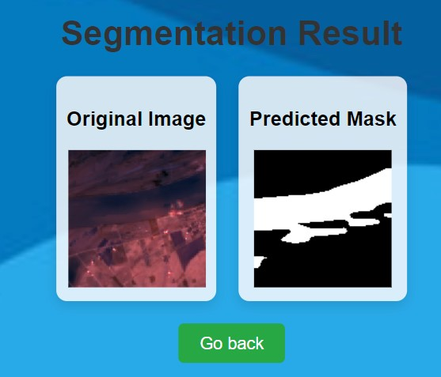

# Water Segmentation Flask Application

This project is a Flask web application that allows users to upload a `.tif` image with 12 channels and perform water segmentation using a pre-trained DeepLabV3 model. The application processes the image, predicts the segmentation mask, and displays the original image and predicted mask side by side.

## Features
- Upload `.tif` files with 12-channel images for segmentation.
- Perform water segmentation using a custom-trained DeepLabV3 model.
- Display the original image and the predicted mask side by side.
- In-memory processing without saving images or results.
- User-friendly interface with support for custom background and CSS.

## Project Structure

```
├── app.py                    # Main Flask application
├── model/                    # Directory for saved model
│   └── best_model.pth        # The saved PyTorch model weights
├── static/                   # Static files (CSS, background image)
│   ├── style.css
│   └── background.jpg        # Background image for the interface
├── templates/                # HTML templates
│   ├── index.html            # File upload page
│   └── result.html           # Page to display segmentation result
└── README.md                 # Project README
```

## Requirements

- Python 3.7+
- Flask
- PyTorch
- torchvision
- rasterio
- Pillow (for image handling)

## Installation

1. **Clone the repository**:

```bash
git clone https://github.com/MSoffar/Satellite-Image-Segmentation-Flask.git
cd Satellite-Image-Segmentation-Flask
```

2. **Create a virtual environment and activate it**:

```bash
python -m venv venv
source venv/bin/activate  # On Windows use `venv\Scripts\activate`
```

3. **Install the required dependencies**:

```bash
pip install -r requirements.txt
```

If you don't have a `requirements.txt`, create one with the following contents:

```
Flask
torch
torchvision
rasterio
Pillow
```

4. **Download or move your pre-trained model to the `model/` directory**:

Place your pre-trained PyTorch model named `best_model.pth` inside the `model/` folder.

## Running the Application

Once everything is set up, run the Flask application with the following command:

```bash
python app.py
```

The application will be available at [http://127.0.0.1:5000/](http://127.0.0.1:5000/).

### Usage
1. Visit the homepage at [http://127.0.0.1:5000/](http://127.0.0.1:5000/).
2. Upload a `.tif` file with 12-channel input.
3. The model will process the image, and the page will display the original image and the predicted water segmentation mask side by side.

## Example



## Customization

- **Background Image**: Replace the `background.jpg` file in the `static/` directory with your own background image to customize the look of the app.
- **CSS Styling**: Modify the `style.css` file inside the `static/` directory to change the appearance of the web interface.

## Model Details

- The segmentation model is a modified version of DeepLabV3 with a custom decoder.
- The model was trained for water segmentation on images with 12 input channels, such as satellite or aerial imagery.
- The classifier (decoder) was custom-built to fit the specific needs of the project.


### How to Use This `README.md`

1. Replace any placeholder text (like `"https://github.com/MSoffar/Satellite-Image-Segmentation-Flask.git"`) with the appropriate links or information.
2. If you plan to include a screenshot of your application, replace the `app_preview.png` with your actual screenshot or delete that section if you don't want it.
3. Customize the "Model Details" section with any additional details relevant to your project.
